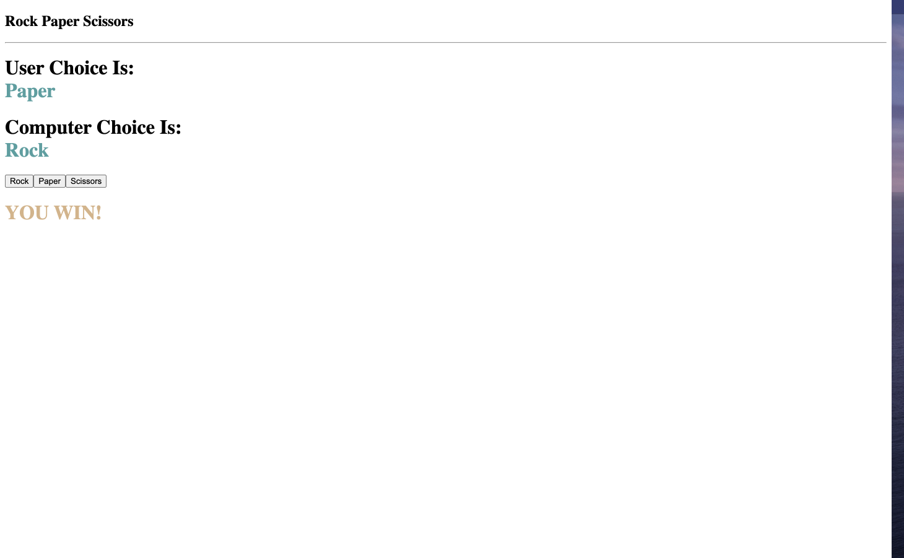

# Rock Paper Scissors - Simple Game built with JS and React

Rock Paper Scissors is a hand game usually played between two people. Each player simultaneously forms one of three shapes with their hand. In this case, you click your selection and the app automatically generates its selection randomly. Please enjoy and feel free to reference it as you build yours!

Screenshot of application:

Live link, [here](https://nard1n.github.io/rock-paper-scissors)

## Table of Contents

* [Installation](#Installation)
* [Usage](#Usage)
* [Contributing](#Contributing)
* [Tests](#Tests)
* [License](#License)
* [Questions](#Questions)

## Installation
Feel free to clone the repo or reference the code and simply run it in your browser

## Usage
For practicing Javascript and React (switch cases, event listeners, useState and useEffect hooks)

## Contributing
We love seeing community contribution to any opensource project! If you would like to contribute, please do.

## Tests
n/a
## License
This project is released under MIT opensource license:

https://opensource.org/licenses/MIT

## Questions
For more about my work, check out my Github profile: https://github.com/nard1n

If you have any questions and would like to chat, please feel free to send me an email directly to nardincodes@gmail.com